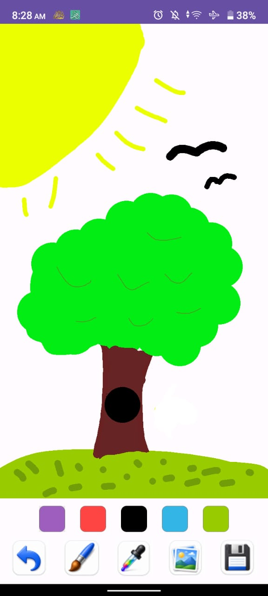
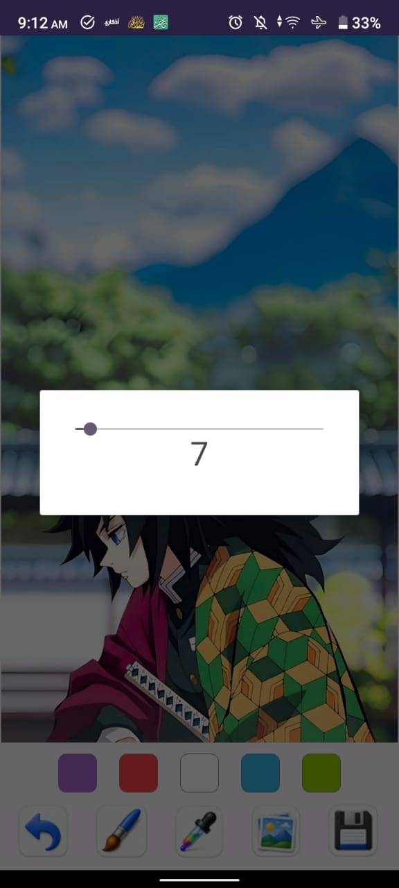
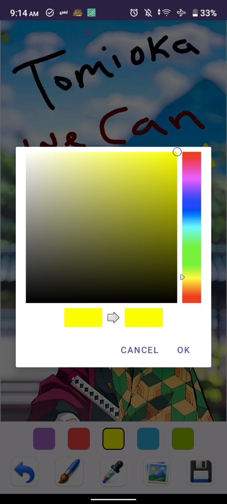
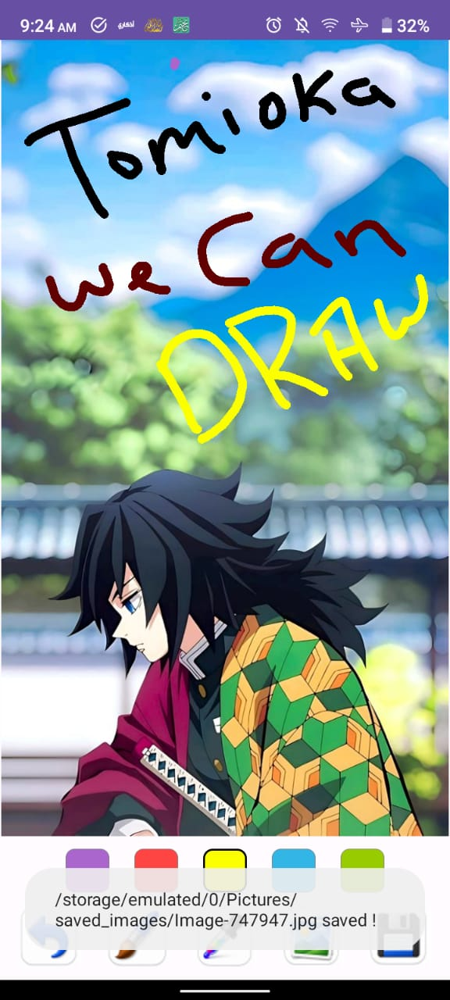

# 🎨 Dooby Brush

A simple Android drawing application built with Kotlin and XML.

## 📱 Features

* **Canvas Drawing:** Draw freely on a digital canvas.
* **Undo Functionality:** Easily undo your last drawing paths.
* **Color Selection:** Choose colors from a quick palette or use an advanced Color Picker.
* **Import from Gallery:** Load any photo from your device storage to draw on top of it.
* **Save Drawings:** Export and save your final artwork directly to your gallery.

## 🛠 Technologies Used

* Kotlin
* Android Studio
* XML Layouts

## 📸 Screenshots

| Blank Canvas | Brush Size Dialog | Color Picker Dialog | Save Image Demo |
| :---: | :---: | :---: | :---: |
|  |  |  |  |

## ⚠️ Compatibility Note

> [!IMPORTANT]
> **Gallery Feature:** Currently works perfectly on **Android 12** and below. It may face some permission issues on **Android 13+** due to recent system media security updates.

## 📥 Download APK

🚀 **[Click Here to Download Dooby Brush APK](apk/Dooby_brush.apk?raw=true)**

## 👨‍💻 Developer

**Abdelrhman Yasser**
